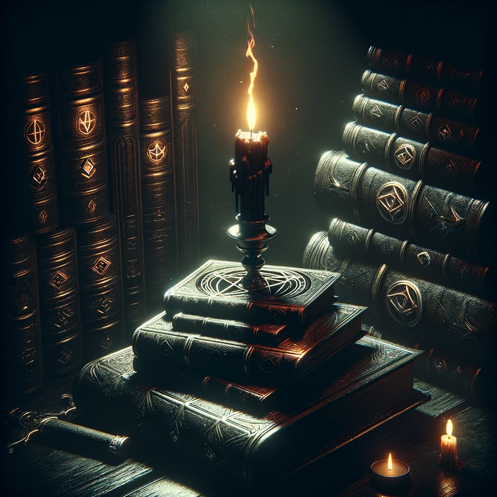

## NanoGPT, in Candle, spelled out



This repo is an implementation of [nanoGPT](https://github.com/karpathy/nanoGPT) in [Candle](https://github.com/huggingface/candle), a Rust-based PyTorch alternative.

If you use this in production, well, that's on you buddy.

## Installation

Install Rust if you haven't already done so. Then in root:

```bash
cargo build
# If on Nvidia platform
cargo build --features cuda
# If on Apple Silicon
cargo build --features metal
```

Add TinyShakespeare dataset:

```bash
mkdir corpus
curl 'https://raw.githubusercontent.com/karpathy/char-rnn/master/data/tinyshakespeare/input.txt' -o corpus/shakespeare.txt
```

## Usage

Train TinyShakespeare tokenizer:

```bash
cargo run --bin train_tokenizer -- -i corpus/shakespeare.txt -o models
```

### Training

Create model config for the parameters you want. Then put it in `models/$MODEL_NAME/config.json`:

```json
{
    "architecture": "transformer",
    "context_size": 8,
    "hidden_size": 32,
    "intermediate_size": 1024,
    "num_attention_heads": 8,
    "num_key_value_heads": 8,
    "hidden_layers": 16,
    "vocab_size": 65,
    "tokenizer_id": "shakespeare-base"
}
```

Train transformer model (hard-coded to TinyShakespeare for now):

```bash
cargo run --release --bin train -F cuda -- --model-type transformer
```

Should be output to `model.safetensors`.

TODO: 
- Allow setting training config from file
- Changing model name
